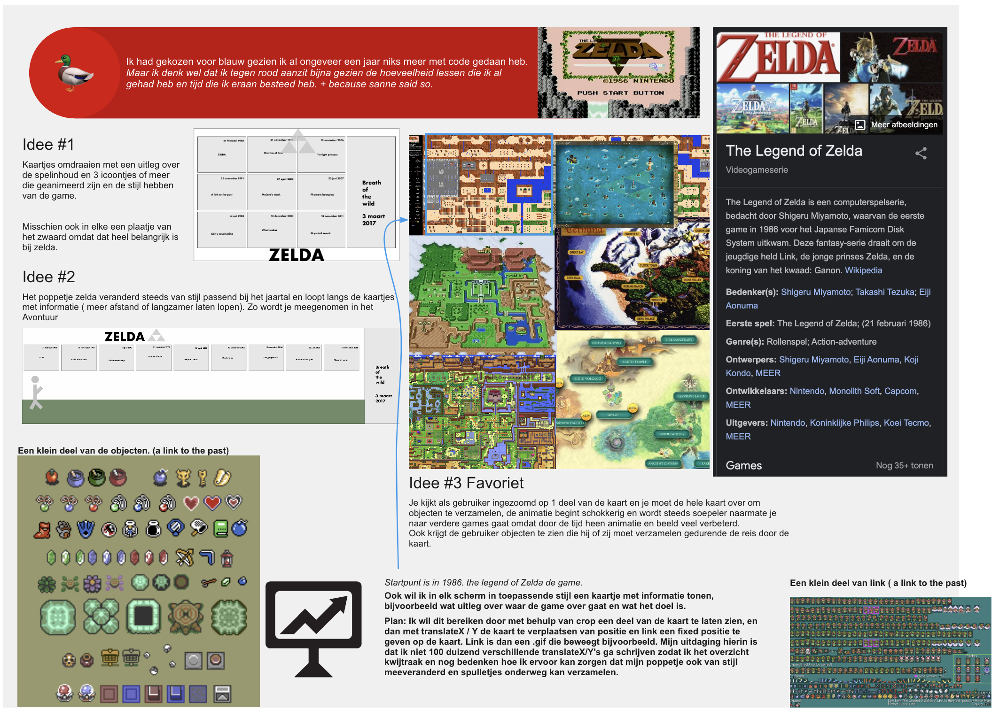
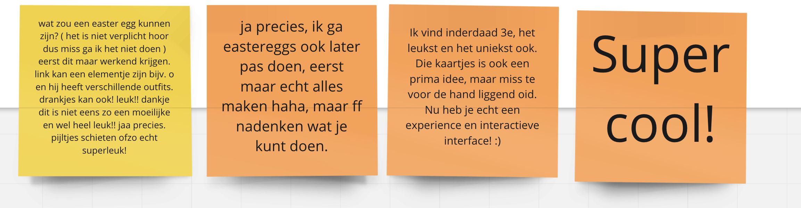
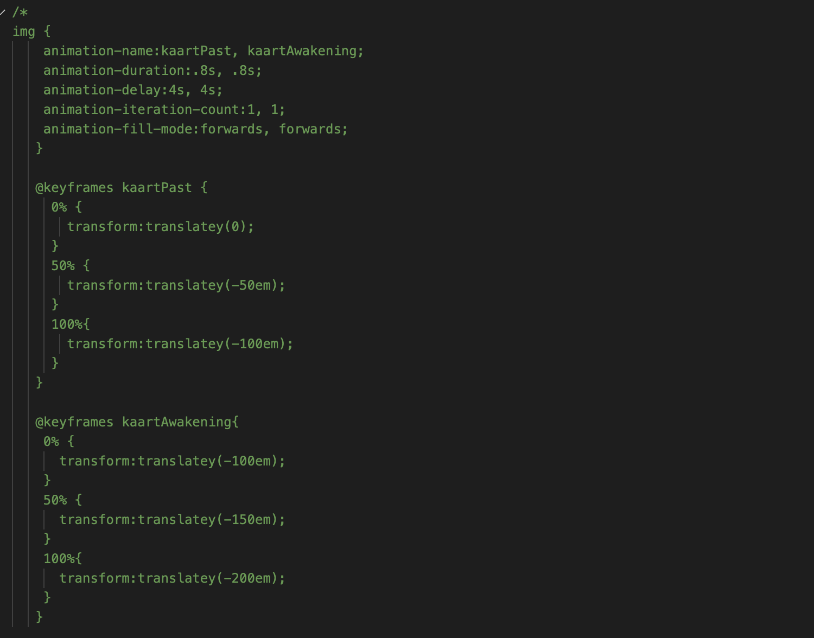
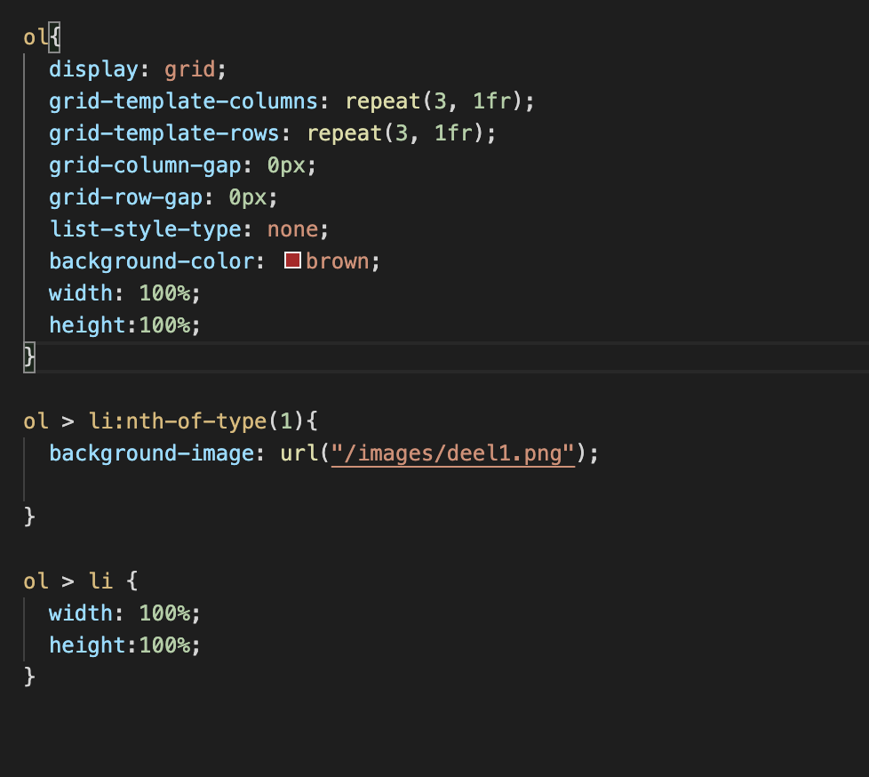
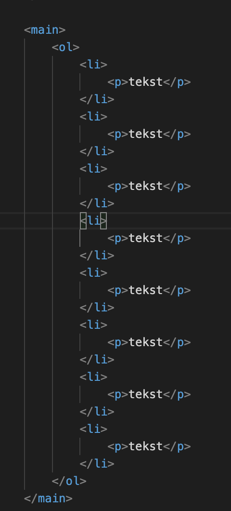

# Procesverslag
Markdown is een simpele manier om HTML te schrijven.  
Markdown cheat cheet: [Hulp bij het schrijven van Markdown](https://github.com/adam-p/markdown-here/wiki/Markdown-Cheatsheet).

Nb. De standaardstructuur en de spartaanse opmaak van de README.md zijn helemaal prima. Het gaat om de inhoud van je procesverslag. Besteedt de tijd voor pracht en praal aan je website.

Nb. Door *open* toe te voegen aan een *details* element kun je deze standaard open zetten. Fijn om dat steeds voor de relevante stuk(ken) te doen.

## Jij

### Ontwerper:
Chantal Valk

#### Je startniveau:
Mijn startniveau is: Rood

# Je plan

  
De eerste versie/schets van je ontwerp & je persoonlijke uitdaging

  ### De eerste versie/schets:
  
  

  ### Je ambitie: 
  Aan deze technieken/punten wil ik werken:
  - punt 1
  - punt 2
  - nog een punt
  - ...
 

## Voortgang/Feedback 1

  
Mijn bevindingen + wijzigingen (minimaal 5)

  ### Bevinding 1:
  Omschrijving van wat er nog niet orde was (tekst en afbeeding(en)).
  Layout animatie problemen:
  Aan de slag geweest met translateY op de poster image om zo de achtergrond te bewegen. Hier ben ik van afgestapt omdat dit een hele lap met animatie's en delay's zou opleveren die ik later slecht zou kunnen aanpassen / begrijpen omdat alles door elkaar heen zou werken. (omhoog, omlaag, links rechts en stops inbouwen waarin link stilstaat.) Ik durfde dus niet verder te bouwen aan deze oplossing en kreeg ook de tips om dat niet zo te doen.
  Lang nagedacht over een andere manier om het aan te pakken of een hele andere oplossing te maken.
  Zie image: 

  #### oplossing:
  Beschrijving hoe je het hebt hebt opgelost of als het niet gelukt is hoe je het zou oplossen (tekst en afbeeding(en)).
  Geen oplossing kunnen vinden.

  ### Bevinding 2:
  Omschrijving van wat er nog niet orde was (tekst en afbeeding(en)).
  Layout animatie problemen:
  Vervolgens heb ik om hulp gevraagd bij Aanne en die kwam met de volgende oplossing:
  
  Hier lukte het helaas niet om het scherm te bewegen, na een aantal keer proberen kreeg ik nogsteeds na de #id te selecteren een lege pagina te zien omdat de browser aangaf de pagina niet te kunnen vinden. Terwijl een leeg #id altijd op dezelfde pagina hoort te blijven als linkje en je niet hoort weg te sturen. ik kon helaas dit niet meer uitvragen aan sanne omdat ik erg ziek ben geworden diezelfde middag.

  #### oplossing:
  Beschrijving hoe je het hebt hebt opgelost of als het niet gelukt is hoe je het zou oplossen (tekst en afbeeding(en)).
  Uiteindelijk heb ik hulp gevraagd bij een studiegenoot die mij javascript aanraden. Dit heb ik gebruikt om de layout te bewegen met een forloop. Door middel van een timeOut kan de animatie gekoppeld worden met tijd. Elke iteratie is een aantal milliseconden. Tussen de 1-100 iteraties kan link naar links lopen, tussen de 101-200 naar beneden enzovoort. Ook is het mogelijk om de image van link te vervangen na een aantal iteraties.

  ### Bevinding 3:
  Besloten om niet verder te gaan met de javascript oplossing, geprobeerd om met behulp van grids een oplossing te maken door de li's een achtergrond te geven en de kaartjes er laten in te plaatsen. dit lukte niet omdat het niet lukte om de kaartjes geen hoogte te en breedte mee te geven binnen het grid.:
  
  

## Voortgang/Feedback 2

  
Mijn bevindingen + wijzigingen (minimaal 5)

  
  ### Bevinding 1:
  Omschrijving van wat er nog niet orde was (tekst en afbeeding(en)).
  
  Het is mij niet gelukt om zonder Javascript interactie te krijgen met animaties. Ik kan met css de achterground van de kaart verplaatsen en ik kan de kaartjes naar links en rechts bewegen, maar om de animatie pas te activeren als er op een item geklikt wordt lukt niet. De animatie kan namelijk alleen een starten met javascript

  #### oplossing:
  Beschrijving hoe je het hebt hebt opgelost of als het niet gelukt is hoe je het zou oplossen (tekst en afbeeding(en)).
  Op dit moment gewerkt met een animatie voor de kaartjes en voor de achtergrond. de snelheid is nog niet correct op elkaar afgestemd maar dit is de oplossing waar ik mee ga werken.

  ### Bevinding 2:
  Omschrijving van wat er nog niet orde was (tekst en afbeeding(en)).

  De animatie van lopen gaat nu enkel nog naar rechts. Om te kisten ook tegelijk met de background naar beneden te laten beneden is lastig.

  #### oplossing:
  Beschrijving hoe je het hebt hebt opgelost of als het niet gelukt is hoe je het zou oplossen (tekst en afbeeding(en)).

  ### Bevinding 3:
  ...

## Voortgang/Feedback 3

  
Mijn bevindingen + wijzigingen (minimaal 5)

  
  ### Bevinding 1:
  Omschrijving van wat er nog niet orde was (tekst en afbeeding(en)).

  #### oplossing:
  Beschrijving hoe je het hebt hebt opgelost of als het niet gelukt is hoe je het zou oplossen (tekst en afbeeding(en)).

  ### Bevinding 2:
  Omschrijving van wat er nog niet orde was (tekst en afbeeding(en)).

  #### oplossing:
  Beschrijving hoe je het hebt hebt opgelost of als het niet gelukt is hoe je het zou oplossen (tekst en afbeeding(en)).

  ### Bevinding 3:
  ...

## Reflectie

  
Mijn eindresultaat & persoonlijke ontwikkeling

  ### Je uitkomst - karakteristiek screenshot(s):
  

  ### Dit ging goed/Heb ik geleerd: 
  Korte omschrijving met plaatje(s)

  

  ### Dit was lastig/Is niet gelukt:
  Korte omschrijving met plaatje(s)

  

## Bronnenlijst

continu bijhouden terwijl je werkt

Nb. Wees specifiek ('css-tricks' als bron is bijv. niet specifiek genoeg).

1. bron 1
2. bron 2
3. ...

